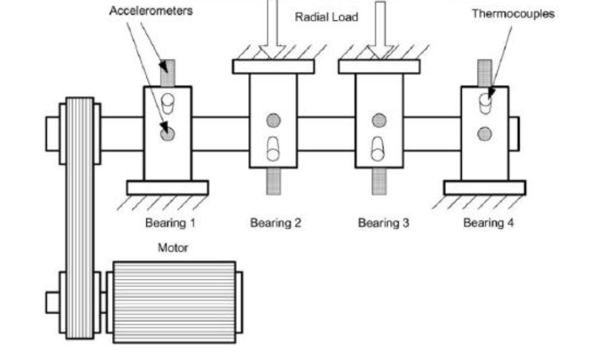
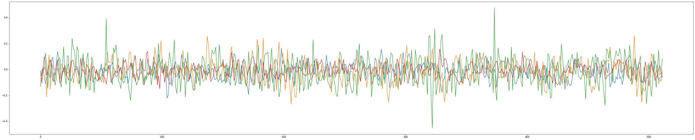
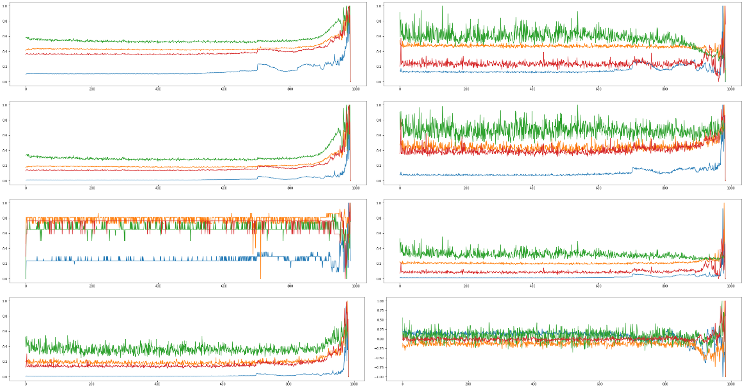

# 使用 MEMS 感測器實現以 IoT 為基礎的預測性維護

# 摘要

# 1. 簡介

近年來雲端算與 AIoT 技術逐漸成為了趨勢，越來越多的企業開始加速了對於雲端的的部署，更催化出了工業 4.0 的誕生，在工業 4.0 中，希望透過工業人工智慧的技術建立具有適應性、有效率的智慧型工廠，故障檢測技術在工業 4.0 中佔有龐大的應用價值。隨著工業機械能夠完成越來越複雜化、自動化的任務，這樣的發展意味著機械各部件得承受更為複雜的運作模式，也就是說，在該作業環境可能易遭受高溫高壓和高運轉量的困擾。因此，故障是不可避免的問題。由於機械設備故障容易導致經濟及能源消耗的損失，故機械狀態監控的需求變得日趨重要。因此本實驗希望利用崁入式系統搭建監測網路達到以下幾項目的：1. 利用遷入式設備搜集工具機運作數據 2. 輕量化模型並直接在遷入式設備部署 3. 考慮到多個axis交互關係分析軸承運作狀態 達到即時工具機檢測之目的。

# 2. 資料與環境設置

實驗先利用IMS公開數據集對模型進行驗證，再利用自己搭建的崁入式感應器對實際運作數據進行搜集與驗證。

## 2.1 IMS dataset
IMS dataset 又稱 NASA Bearing Dataset，該資料對工具機和連接的四個軸承
於每個軸承安裝加速度計(圖2.1)。所有故障均發生在超過軸承的設計使用壽命後發生，此軸承設計使用壽命為 1 億轉。
在數據採集上，利用高採樣頻率的IPC與震動感應器PCB 353B33 蒐集加速度數據(圖2.2)，讓每個數據集以$20k Hz$的採樣頻率搜集加速度數據。

|          |
| :----------------------: |
| **圖2.1 實驗儀器結構圖** |

|      |
| :--------------------: |
| **圖2.2 加速度計數據** |

## 2.2 利用崁入式系統蒐集實際資料

在實際數據搜集的方面我們利用IIS3DWB的工業用加速度感應器結合MCU作為數據蒐集平台，並將加速度數據採樣率固定在4KHz，再透過終端服務器進行數據整合，以對工具機震動數據蒐集，實驗設備如圖2.3。實驗在數據搜集過程中施加外力干擾作為不同程度的故障指標，針對不同運作狀態定義標籤。

|  |
| :---------------------: |
| **圖2.3 數據採樣設備**  |

# 3. 實驗與分析

## 3.1 資料前處理
因為原始的數據每秒都有20480個採樣點，龐大的數據點不利於即時分析，因此針對原始的加速度數據切分取樣點，並轉換成時域特徵($time domain features$)，以$root-mean-square$ (RMS), $variance$ (VAR), $kurtosis$ (KUR), $peak value$ (PV), $skewness$ (SKW), $median$ (MED), $rms*kurtosis$ (F1) and $rms*peak$ (F2)八種特徵進行後續訓練，其個別算法如下：
1. $\mathrm{RMS} =\sqrt{(\frac{1}{N})\sum_{i=1}^{N}(x)^{2}}$
2. $\mathrm{VAR} = \frac{1}{N}\sum_{i=1}^{N}(x_i - \overline{x})^2$
3. $\mathrm{KUR} = \frac{1}{N}\sum_{i=1}^{N}\frac{(x_i-\overline{x})^4}{\sigma^4}$
4. $\mathrm{Peak Value} = \max \mathrm{value} - \min \mathrm{value}$
5. $\mathrm{SKW} = \frac{1}{N}\sum_{i=1}^{N}\frac{(x_i-\overline{x})^3}{\sigma^3}$
6. $\mathrm{MED} = (\frac{N+1}{2})^{th}$
7. $F1 = RMS * KUR$
8. $F1 = RMS * PV$

轉換完成後，再將數據正規化到[0,1]之間，轉換完後的特徵數據如圖3.1所示。

|  |
| :---------------------: |
| **圖3.1 經過正規化後的時域特徵**  |

## 3.2 分類模型

# 4. 結論

# 5. 參考資料
- \[1\]Analysis of NASA Bearing Dataset of the University of Cincinnati by Means of Hjorth’s Parameters
- \[2\]Analysis  of  the  Rolling  Element  Bearing  data  set  of  the  Center  for Intelligent Maintenance Systems of the University of Cincinnat
- \[3\] A. Widodo, E. Y. Kim, J. D. Son, B. S. Yang, A. C. Tan, D. S. Gu, ... 
and J. Mathew, “Fault diagnosis of low speed bearing based on relevance 
vector machine and support vector machine,” Expert systems with 
applications, vol. 36 no. 3, pp. 7252-7261, 2009.