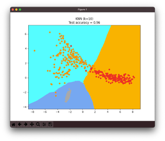
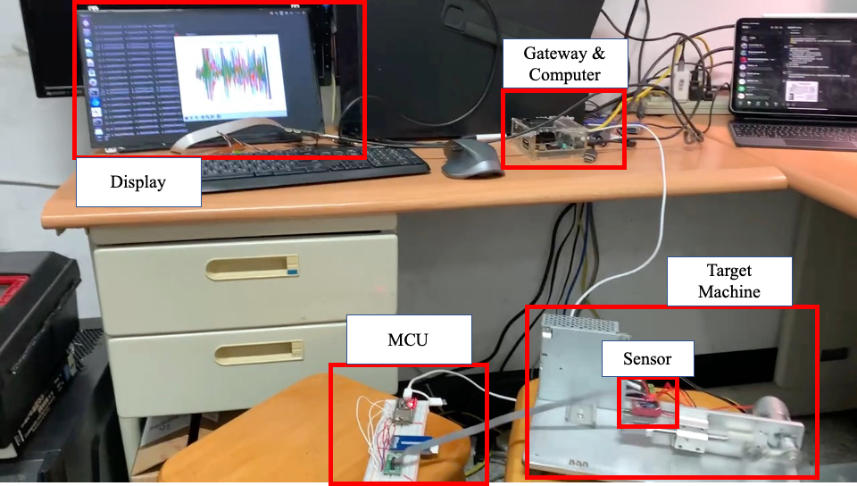

<!--header:Marp -->
# 使用 MEMS 感測器實現以 IoT 為基礎的預測性維護
## D0748284 楊孟軒

---

# 1 Introduction

----

## 1.1 Motivation

隨著工業機械能夠完成越來越複雜化、自動化的任務，這樣的發展意味著機械各部件得承受更為複雜的運作模式，也就是說，在該作業環境可能易遭受高溫高壓和高運轉量的困擾。因此，故障是不可避免的問題。由於機械設備故障容易導致經濟及能源消耗的損失，故機械狀態監控的需求變得日趨重要。
簡單來說：~~大專生計劃錢都拿了現在逃不掉了 嗚嗚~~

----

## 1.2 Task Definition

1. 利用遷入式設備搜集工具機運作數據
2. 輕量化模型並直接在遷入式設備部署
3. 考慮到多個axis交互關係分析軸承運作狀態

---

<!-- - Description on the research works/methods relevant to your research topic
    - 與您的研究課題相關的研究工作/方法的描述 -->

# 2 Dataset description

1. IMS dataset(aka NASA Bearing Dataset)
2. 實際設備搜集資料

----

## 2.1 Dataset description

|                        |                IMS                |          實際設備搜集資料          |
| :--------------------: | :--------------------------------: | :--------------------------------: |
|   Channels   |                 4                 |                 3                 |
|    Number of files    |          $\approx 20M$          |            $\geq20k$            |
| Window size(frequence) |               10240               |                4096                |
|         setup         |  |  |
|                        |                                    |                                    |

---

# 3 Learning techniques

----

## 3.1 feature extraction

<!-- The extracted time domain features include $root-mean-square$ (RMS), $variance$ (VAR), $kurtosis$ (KUR), $peak value$ (PV), $skewness$ (SKW), $median$ (MED), $rms*kurtosis$ (F1) and $rms*peak$ (F2). The mathematical expression for the same is given as under : -->

將震動數據依照$window\ size$ 分開
並分別計算個別的時域特徵($time domain features$)

* $\mathrm{RMS} =\sqrt{(\frac{1}{N})\sum_{i=1}^{N}(x)^{2}}$
* $\mathrm{VAR} = \frac{1}{N}\sum_{i=1}^{N}(x_i - \overline{x})^2$
* $\mathrm{KUR} = \frac{1}{N}\sum_{i=1}^{N}\frac{(x_i-\overline{x})^4}{\sigma^4}$
* $\mathrm{Peak Value} = \max \mathrm{value} - \min \mathrm{value}$
* $\mathrm{SKW} = \frac{1}{N}\sum_{i=1}^{N}\frac{(x_i-\overline{x})^3}{\sigma^3}$
* $\mathrm{MED} = (\frac{N+1}{2})^{th}$

----

* Normalized features used as training data

----

## 3.2 Classifiers model

<!-- Compare several learning algorithms -->

分別用以下幾種演算法對資料進行訓練，比較輸出結果並考量實際效率以進行部署

1. Nearest Neighbors
2. Linear SVM
3. RBF SVM
4. Decision Tree
5. Random Forest
6. AdaBoost
7. Naive Bayes

---

# 4 Result and disscussion

----

## 4-1 Classification Results Obtained Without PCA

|            model            | Accuracy(%) |        Parameter        |
| :-------------------------: | :---------: | :----------------------: |
| **Nearest Neighbors** |    93.4    |           N=3           |
|    **Linear SVM**    |    83.2    | kernel="linear", C=0.025 |
|           RBF SVM           |    93.4    |       gamma=2, C=1       |
|   **Decision Tree**   |    97.9    |       max_depth=5       |
|        Random Forest        |    94.7    |       max_depth=5       |
|     **AdaBoost**     |    98.4    |                          |
|         Naive Bayes         |    87.5    |                          |

----

## 4-2 Classification Results Obtained using PCA

<!--  -->

|  |  |
| :--------------------------------: | ---------------------------------- |
|  |  |
* 我們選擇了上表最佳的兩個模型(AdaBoost,Decision Tree)和最低的(Linear SVM)額外加上KNN，比較PCA對特徵降維對準確性的影響

<!-- 

 -->

----

## 4-2 Deploy model in MCUs

---

# 5 Conclusion
----

要把模型用到MCU會需要比較多的步驟，因此這次在實際部署在MCU上目前只有使用PCA+KNN測試，同時我們也嘗試定義其他工具機的狀態標籤，但因為感應器的限制，當工具機高功率運作加速度會大於最大採樣值，因此本次以三個狀態作為標記。

<!--   -->
<!-- PCA=3時可以有效的(>90%)辨識工具機狀態 -->
----

## 未來展望
這次研究在實際部署中，遇到最大的問題是要在兼顧模型正確性的同時顧慮到MCU的計算量，因此希望未來可以用兩段式的架構，先藉由前端MCU搜集數據後傳送道伺服器分析，以使用更複雜的魔性進行處理
---

# 6 References
- \[1\]A. Widodo, E. Y. Kim, J. D. Son, B. S. Yang, A. C. Tan, D. S. Gu, ... 
and J. Mathew, “Fault diagnosis of low speed bearing based on relevance 
vector machine and support vector machine,” Expert systems with 
applications, vol. 36 no. 3, pp. 7252-7261, 2009.
- \[2\]A. Widodo, E. Y. Kim, J. D. Son, B. S. Yang, A. C. Tan, D. S. Gu, ... 
and J. Mathew, “Fault diagnosis of low speed bearing based on relevance 
vector machine and support vector machine,” Expert systems with 
applications, vol. 36 no. 3, pp. 7252-7261, 2009.
- \[3\]Analysis  of  the  Rolling  Element  Bearing  data  set  of  the  Center  for Intelligent Maintenance Systems of the University of Cincinnat